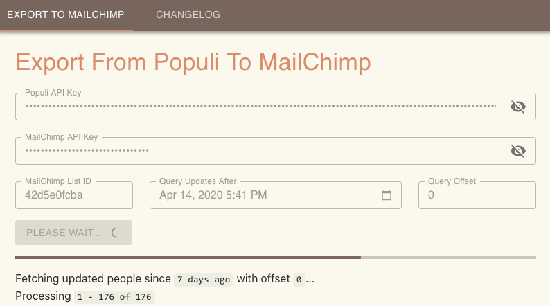

# mnw-automation



This was started with boilerplate from <https://github.com/Robinfr/electron-react-typescript>

## Development

```bash
git clone git@github.com:claytonfbell/mnw-automation.git
cd mnw-automation
npm install
npm run start-dev
```

## Versioning

Commands that increment version number:

```bash
# major, minor, or patch
npm version patch
```

## Changelog

Update Changelog

```bash
npm run changelog
```

## Packaging

We use [Electron builder](https://www.electron.build/) to build and package the application.

You can make builds for specific platforms (or multiple platforms) by using the options found [here](https://www.electron.build/cli). E.g. building for all platforms (Windows, Mac, Linux):

_Note: I found it helpful to delete the release folder before building to avoid an error._

```bash
npm run dist -- -mwl
```
